# S-Clustr

 
 
 
 
 
 
 

 

    
    

        Maptnh
        Не ограничивайте свои действия виртуальным миром.
        <a href="https://github.com/MartinxMax" target="_blank" style="margin-top: 8px; color: #0366d6; text-decoration: none; font-weight: bold;">GitHub: Maptnh</a>
    

    
    

        Jay Steinberg
        Man kann die Menschen, die man hasst, in der virtuellen Welt nicht töten.
        <a href="https://github.com/MartMakr" target="_blank" style="margin-top: 8px; color: #0366d6; text-decoration: none; font-weight: bold;">GitHub: jaysteinberg</a>
    

# Overview

S-Clustr has undergone a major upgrade, now smaller in size and more efficient.

Optimization Details|
--|
1. Abandoned the Python version of Shadow Cluster (due to high memory consumption and low execution efficiency), switched to Java version for high concurrency traffic handling|
2. Merged ROOT port server, integrated into a single server application. Both compression ratio and memory usage are reduced by about 99.7%|
3. Abandoned DingTalk data push module (insecure)|
4. New encrypted pseudo-protocol packet, reducing data transmission size and eliminating characteristics|
5. Defense against replay attacks|
6. Anonymous mode to access nodes (using dual-key encryption throughout, protecting the privacy of anonymous users in real-time)|
7. Decentralized, each server can act as a root node (child nodes can join the network using a ring key), with a maximum of 50,000 controlled devices per node|
8. Man-in-the-middle relay control|
9. Autonomous choice of node control types|
10. Ring network sharing circle|

| Type | Device | LAN | Wireless | 4G |
| --- | ---- | --- | --- | --- |
| IOT | Arduino | √ | × | √ |
| IOT | Hezhou AIR780e | × | × | √ |
| IOT | ESP8266 | × | √ | × |
| IOT | AT89C51 | × | × | √ |
| IOT | STM32 | × | × | √ |
| OT/PLC | SIEMENS S7-1200 | √ | × | × |
| OT/PLC | SIEMENS S7-200 | √ | × | × |
| IT | PC | √ | √ | × |

# About

>(Anonymous User) asks: What kind of tool is S-Clustr? Answer: It is a decentralized distributed node network controller for one-to-many network control. You can write your own backdoor programs for clients (not limited to personal computers, but also including embedded devices) to connect to S-Clustr for large-scale cluster control of millions of devices.

>(Anonymous User) asks: How is the stealth of the traffic communication? Answer: The entire communication process is encrypted with dual keys. Even if a man-in-the-middle attempts to replay your data packets, they cannot successfully control them.

# Core Concepts

## Dual Key Authentication & Constructing Pseudo Protocols

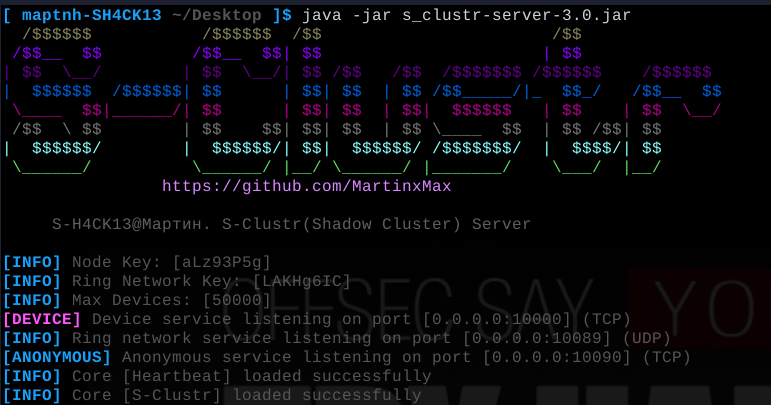

S-Clustr (Shadow Cluster) introduces the concept of dual-key authentication in version 3.0.

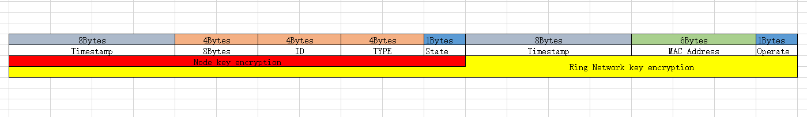

By encrypting data, it ensures the data security of anonymous connections.

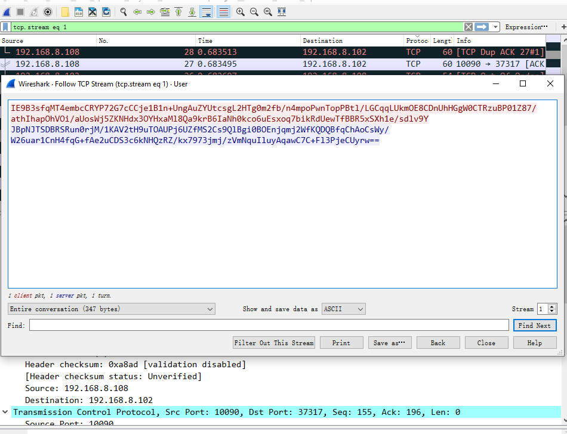

## Decentralized & Distributed Control

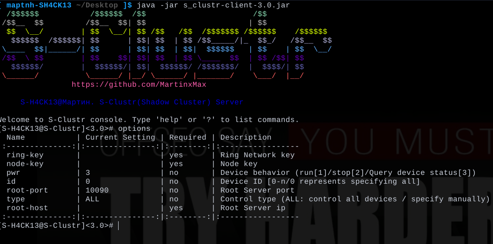

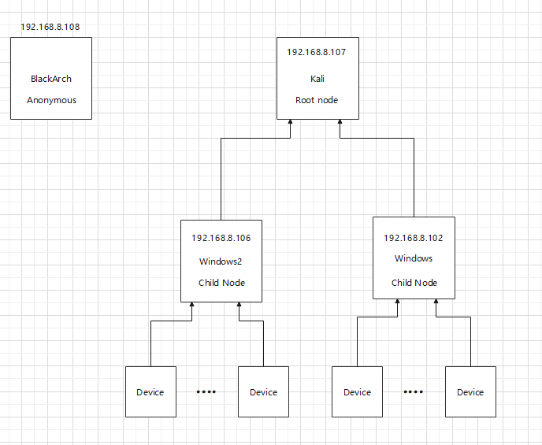

In the diagram, each server can become a root node. To join nodes, we need to provide a ring network key to join this Club. When connecting to the Root node server, you will have the highest control authority over all devices within the included nodes. However, to protect node security, you need to provide the node key (not everyone will trust you without reservation).

# Ring Network Formation

# Overview

In practice, no more than 2 devices are required (of course, the more machines that join your Club, the more you can do). If you are a server, it is entirely feasible.

# Server

`$ java -jar s_clustr-server-3.0.jar -h`

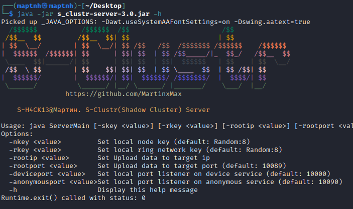

### Root Node Server

Regardless of whether you are on Windows or Linux, you can deploy the server.

`$ java -jar s_clustr-server-3.0.jar -nkey whoami123 -rkey h4ck13io`

Node key: whoami123
Ring key: h4ck13io

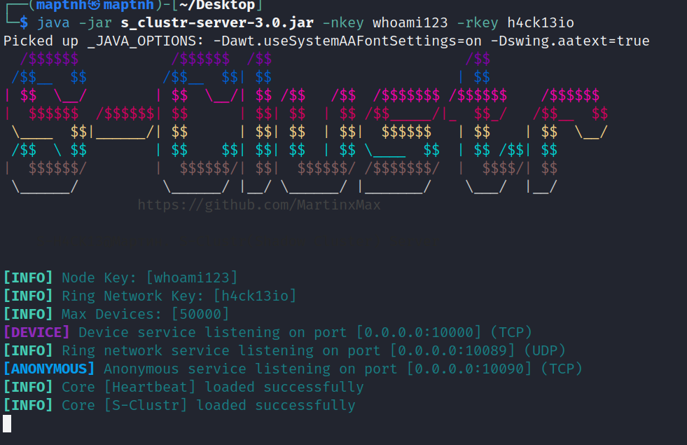

### Child Node Server

Windows2:

`$ java -jar s_clustr-server-3.0.jar -nkey FVckG4me -rkey h4ck13io -rootip 192.168.8.107`

Join the ring network, becoming a node.

Node key: FVckG4me
Ring key: h4ck13io

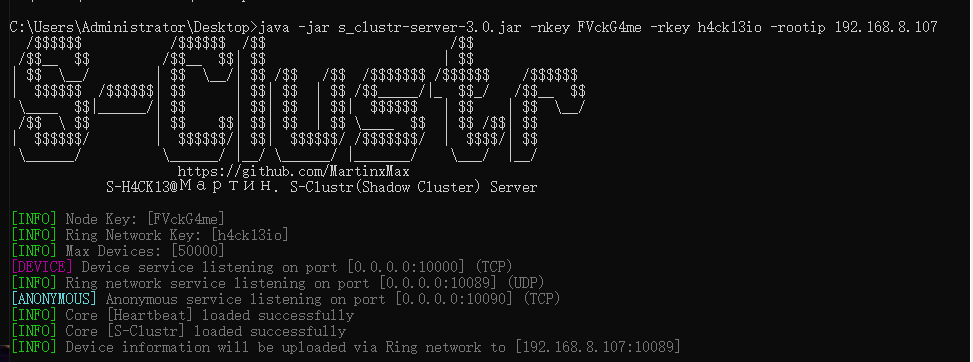

For testing, another child node needs to be added.

Windows:

`$ java -jar s_clustr-server-3.0.jar -nkey OPOPOPOP -rkey h4ck13io -rootip 192.168.8.107`

Node key: OPOPOPOP
Ring key: h4ck13io

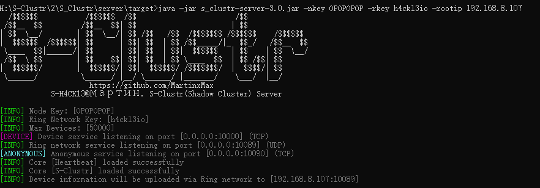

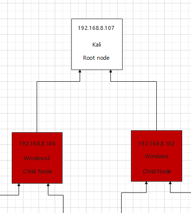

# Anonymous Client

`$ java -jar s_clustr-client-3.0.jar`

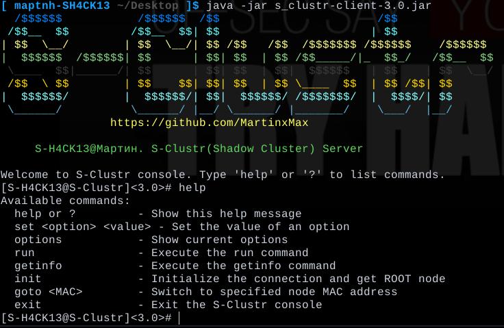

Configure `set root-host`, `set node-key`, `set ring-key` information.

`[S-H4CK13@S-Clustr]<3.0># init`

Initialize and try to connect to the Root server.

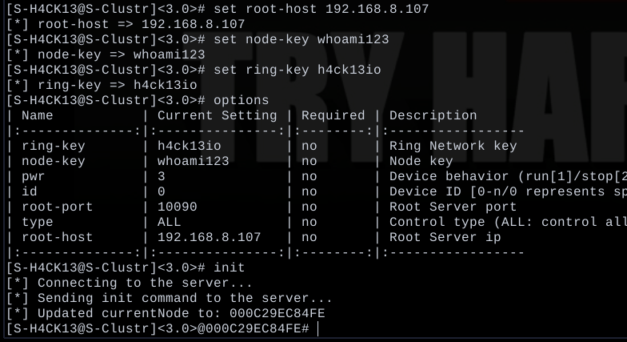

After a successful connection, a root node identifier will appear.

## Retrieve Root Node Device Status

Ensure you are in the root node device status.

`[S-H4CK13@S-Clustr]<3.0>@000C29EC84FE# set pwr 0`

`[S-H4CK13@S-Clustr]<3.0>@000C29EC84FE# set pwr 3`

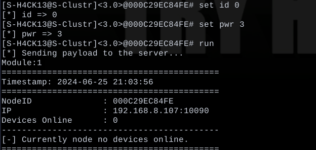

## Retrieve Child Node Status

In root node status, enter the `getinfo` command to retrieve the status of all nodes.

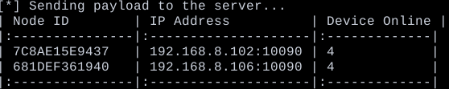

## Enter Node

In root node status, enter the `goto <Node ID>` command to enter the node. Enter the `exit` command to exit the current node.

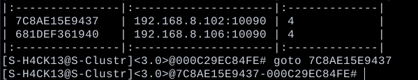

## Node Device Control

Determine the current node location and choose to set the pwr parameter behavior [1. Start 2. Stop 3. Status query]

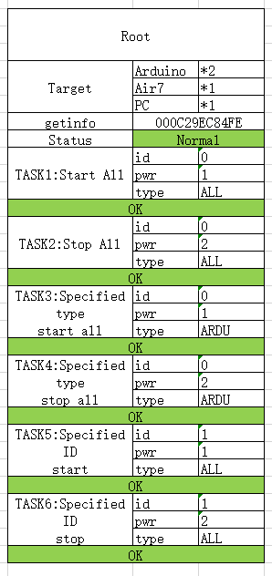

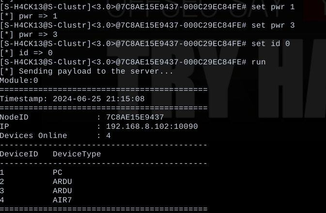

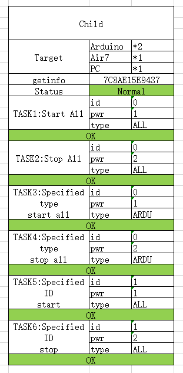

Control must be confirmed with the correct node key for the current node where you are controlling.

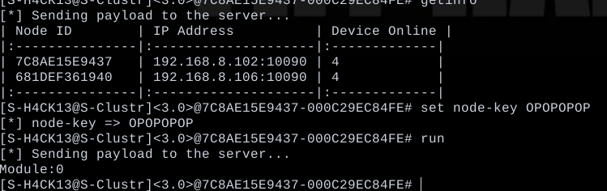

Node server:

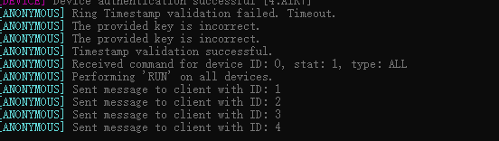

Simulated controlled client:

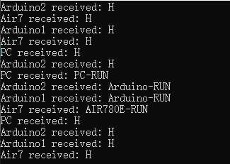

Similarly, you can specify the type to stop using the `set type ` parameter.

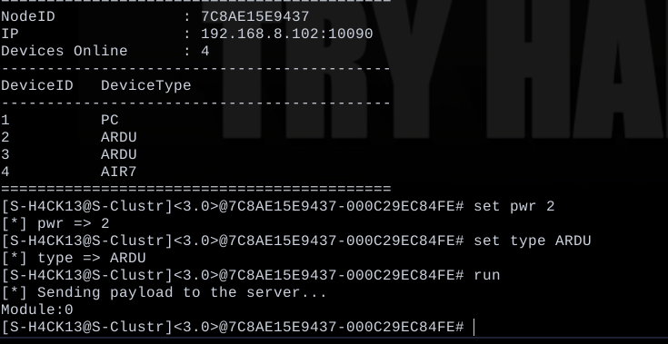

